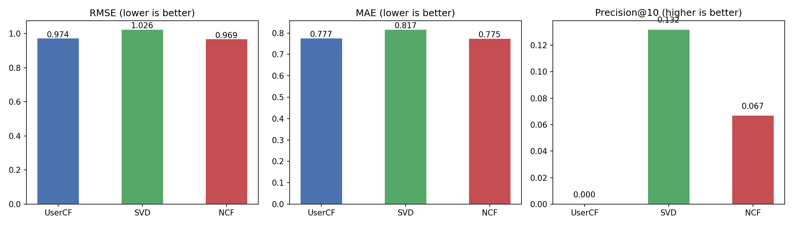
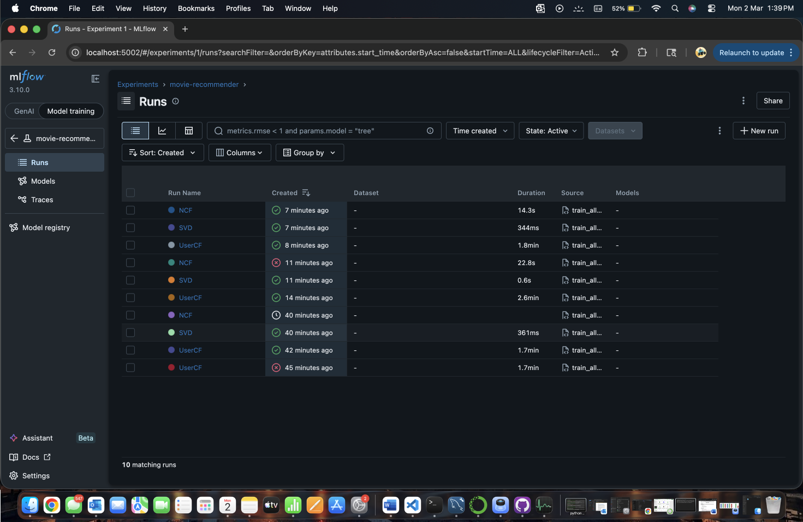
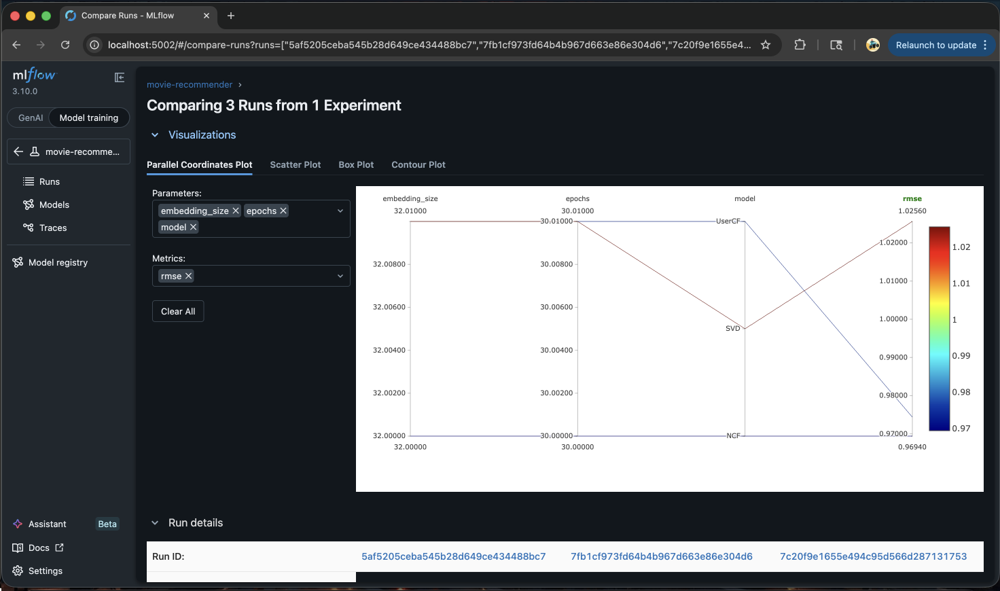
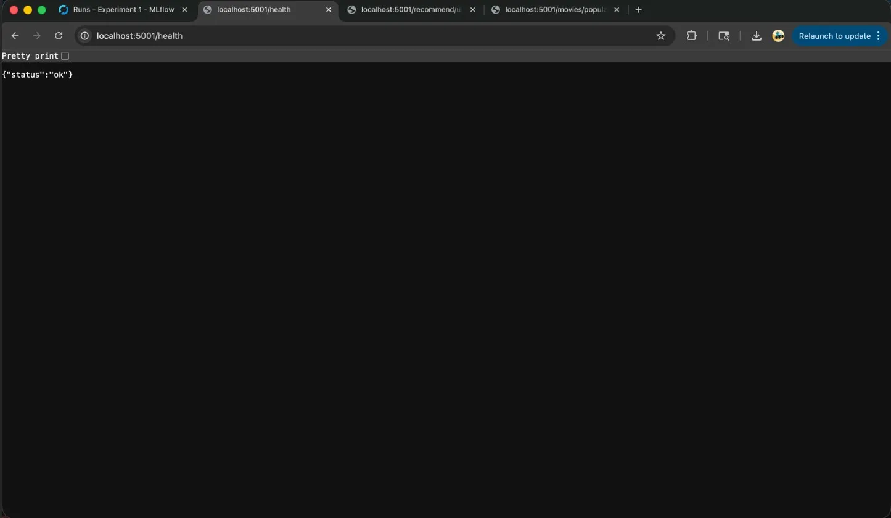
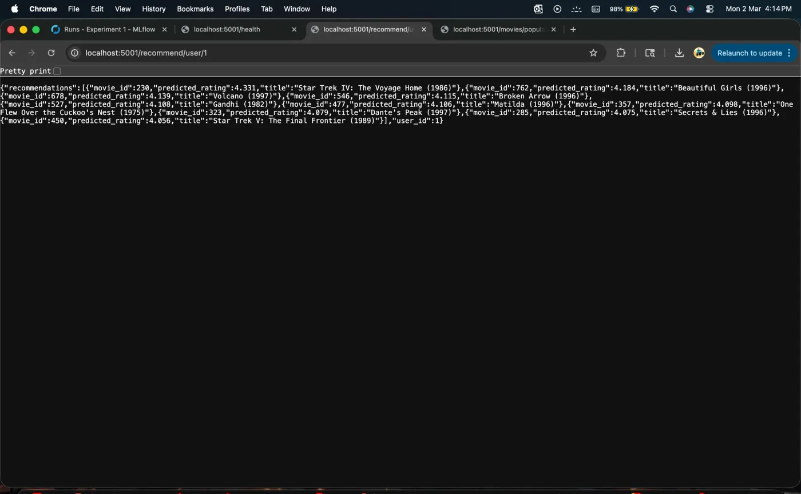

# 🎬 Movie Recommendation System

A production-ready movie recommendation system built from scratch, comparing three machine learning approaches on the MovieLens 100K dataset. Built with Python, PyTorch, Flask, MLflow, and Docker.

[](https://github.com/MaddyakaAnkit/movie-recommender/actions)

---

## 🎯 What It Does

Given a user's movie rating history, the system predicts which movies they'll enjoy next — the same core problem solved by Netflix, Spotify, and Amazon.

- **943 users** get personalized recommendations
- **1,682 movies** in the catalog
- **100,000 ratings** used for training
- Live REST API returns recommendations in milliseconds

---

## 📊 Model Comparison



I built and compared three different recommendation approaches:

| Model | RMSE ↓ | MAE ↓ | Precision@10 ↑ | Best At |
|-------|--------|-------|----------------|---------|
| User-Based CF | 0.974 | 0.777 | 0.000 | Simple interpretable baseline |
| SVD | 1.026 | 0.817 | **0.132** | Ranking & recommendations |
| NCF (NeuMF) | **0.969** | **0.775** | 0.067 | Rating prediction accuracy |

> **Key Insight:** NCF achieves the best rating prediction accuracy (RMSE: 0.969) while SVD leads in recommendation relevance (Precision@10: 0.132) — revealing a real production trade-off between accuracy and ranking quality.

---

## 🧠 Experiment Tracking with MLflow

Every training run is tracked automatically — parameters, metrics, and curves logged for full reproducibility.



### Parallel Coordinates — All 3 Models Compared


### NCF Training Loss Curve
NCF trained for 17 epochs with early stopping at optimal weights (best val_loss: 0.9509 at epoch 12).

---

## 🌐 REST API

### Health Check


### Personalized Recommendations


User 1 gets Star Trek, Gandhi, One Flew Over the Cuckoo's Nest.
User 50 gets Mars Attacks!, Blues Brothers, Mission Impossible.

Two completely different users → two completely different recommendations. ✅

---

## 🏗️ Project Structure
```
movie-recommender/
├── src/
│   ├── baseline_model.py  # User-Based Collaborative Filtering
│   ├── svd_model.py       # Matrix Factorization via SVD
│   ├── ncf_model.py       # Neural Collaborative Filtering (NeuMF)
│   ├── evaluate.py        # RMSE, MAE, Precision@K, Recall@K, NDCG@K
│   └── train_all.py       # Full training pipeline
├── api/
│   └── app.py             # Flask REST API
├── tests/
│   └── test_models.py     # 9 pytest unit tests
├── screenshots/
├── Dockerfile
└── requirements.txt
```

---

## 🚀 Run It Yourself
```bash
git clone https://github.com/MaddyakaAnkit/movie-recommender.git
cd movie-recommender
pip install -r requirements.txt

# Download MovieLens 100K from https://grouplens.org/datasets/movielens/100k/
# Extract into data/raw/ml-100k/

# Train all 3 models (~10 mins)
python -m src.train_all

# Start the API
PYTHONPATH=. python api/app.py
```

---

## 🌐 API Endpoints

| Endpoint | Method | Description |
|----------|--------|-------------|
| `/health` | GET | Health check |
| `/recommend/user/{id}` | GET | Top-N personalized recommendations |
| `/predict` | POST | Predict rating for any user+movie pair |
| `/movies/popular` | GET | Popular movies for new users |

### Example Calls
```bash
# Get top 10 recommendations for user 1
curl http://localhost:5001/recommend/user/1

# Get top 5 recommendations for user 50
curl http://localhost:5001/recommend/user/50?n=5

# Will user 1 like Star Wars?
curl -X POST http://localhost:5001/predict \
  -H "Content-Type: application/json" \
  -d '{"user_id": 1, "movie_id": 50}'
# → predicted_rating: 4.888 ⭐
```

---

## 🐳 Docker
```bash
# Build
docker build -t movie-recommender .

# Run
docker run -p 5001:5001 movie-recommender

# Test
curl http://localhost:5001/health
# → {"status": "ok"}
```

---

## 🧪 Tests
```bash
pytest tests/ -v
```
```
test_precision_at_k         PASSED
test_recall_at_k            PASSED
test_ndcg_bounded           PASSED
test_rmse_perfect           PASSED
test_user_cf_predict_in_range PASSED
test_user_cf_cold_start     PASSED
test_user_cf_excludes_seen  PASSED
test_svd_predict_in_range   PASSED
test_svd_cold_start         PASSED

9 passed ✅
```

---

## 🛠️ Tech Stack

| Category | Tools |
|----------|-------|
| Deep Learning | PyTorch |
| Machine Learning | scikit-learn, scipy |
| Data Processing | pandas, numpy |
| API | Flask, Flask-CORS |
| Experiment Tracking | MLflow |
| Testing | pytest |
| Containerization | Docker |
| CI/CD | GitHub Actions |

---

## 📚 Dataset

[MovieLens 100K](https://grouplens.org/datasets/movielens/100k/) — Real movie ratings collected by GroupLens Research

| Stat | Value |
|------|-------|
| Users | 943 |
| Movies | 1,682 |
| Ratings | 100,000 |
| Sparsity | 93.7% |
| Rating Scale | 1–5 stars |
| Time Period | 1998–2018 |

---

## 👨‍💻 About

Built by **Ankit Raj Sharma**

This project demonstrates end-to-end ML engineering — from data processing and model training to API deployment and containerization.

[](https://github.com/MaddyakaAnkit)